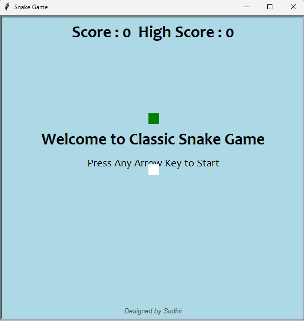
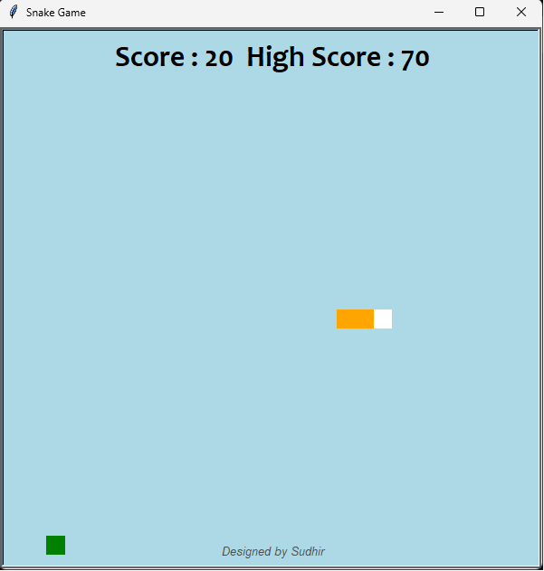

# 🐍 Classic Snake Game

A modern version of the classic Snake Game built using Python's Turtle graphics.

## ✨ Features

- Smooth snake movement
- Increasing game speed
- Random food colors and shapes
- Live score & high score
- Self collision detection
- Wall collision detection
- Clean UI
- Welcome screen
- Lightweight and fast

## 📷 Preview

<p align="center">
  
</p>
<p align="center">
  
</p>

## 🚀 Requirements

- Python 3.10+
- Turtle (comes with Python)

## ▶️ Run

```bash
python snake.py
```

## 🎮 Controls

| Key | Action |
|------|--------|
| ↑ | Move Up |
| ↓ | Move Down |
| ← | Move Left |
| → | Move Right |

## 📂 Project Structure

```
snake-game/
│
├── snake.py
├── README.md
└── screenshot.png
```

## 👨‍💻 Author

**Sudhir Kumar Gupta**

GitHub:
https://github.com/Spidy-Sudhir

LinkedIn:
https://www.linkedin.com/in/spidy-sudhir/

⭐ If you like this project, don't forget to star the repository!
